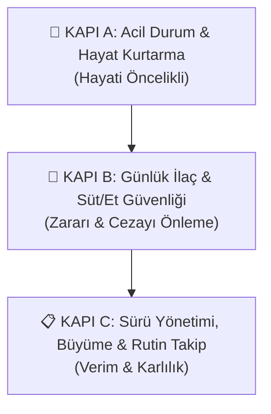

# 🐄 Sığır Sağlık Rehberi - Kullanım Kılavuzu

**Sığır Sağlık Rehberi**, internet bağlantısı ve sunucu kurulumu gerektirmeyen, doğrudan telefon ve bilgisayar tarayıcısında çalışan, Progressive Web App (PWA) mimarisine sahip %100 çevrimdışı bir büyükbaş sürü sağlığı, acil müdahale, besi ve süt yönetim asistanıdır.

---

## 🚀 1. Hızlı Başlangıç & PWA Kurulumu

### Telefonunuza Yükleme (Android / iOS):
1. İnternet bağlantınız varken **[https://mserman90.github.io/sigir-saglik-rehberi/](https://mserman90.github.io/sigir-saglik-rehberi/)** adresine gidin.
2. Tarayıcı menüsünden (üç nokta veya paylaş butonu) **"Ana Ekrana Ekle"** veya **"Uygulamayı Yükle"** seçeneğine dokunun.
3. Telefonunuzun ana ekranına uygulama simgesi eklenir. Artık dağda, merada, internetin ve baz istasyonunun hiç çekmediği bodrum ahırlarda dahi tam ekran ve jet hızında çalışır.

### Bilgisayarda Açma:
- Doğrudan web adresini açabilir veya projedeki [`index.html`](./index.html) dosyasını herhangi bir tarayıcıda çift tıklayarak çalıştırabilirsiniz.

---

## 🧭 2. Klinik & Operasyonel Mantık Sırası (3 Kapı Sistemi)

Uygulamanın tüm butonları, alt menüsü ve modülleri rastgele değil; bir çiftlikte veya ahırda karşılaşılan **klinik aciliyet** ve **ekonomik risk** sırasına göre **3 Mantıksal Kapı** halinde dizilmiştir:

1. **🚨 Kapı A: Acil Durum & Hayat Kurtarma:** Ölüm kalım anlarında saniyelerin önemli olduğu ilk yardım ve triyaj modülleri.
2. **🥛 Kapı B: Günlük İlaç & Süt/Et Güvenliği:** Antibiyotik kalıntısının tanka karışıp tüm sütü döktürmesini veya kesim kuralını ihlal etmesini önleyen İKAS, sağımcı ekranı ve zarar defteri.
3. **📋 Kapı C: Sürü Yönetimi, Büyüme & Rutin Takip:** Tohumlama, buzağı bakımı, aşı takvimi, kantar/tartım, geviş sayımı ve besi dana karşılama operasyonları.

---

## 🚨 3. KAPI A: Acil Durum & Hayat Kurtarma (Hayati Öncelikli)

Ahırda alarm çaldığında veya bir hayvan yıkıldığında ilk başvurulacak hayat kurtarma kapısıdır.

### 🆘 3.1. Acil İlk Yardım & Besi Hastalıkları Müdahalesi
Veteriner hekim ahıra ulaşana kadar hayat kurtaracak kritik saha adımları:
- **⚖️ Canlı Ağırlık Doz Hesaplayıcı:** Hayvanın tahmini veya kantar kilosu girildiğinde, anafilaktik şok için hayat kurtaran Adrenalin dozunu (1:1000 Adrenalin, her 45 kg için 1 mL) otomatik hesaplar.
- **💉 İğne / Aşı Şoku (Anafilaksi):** İlacı derhal kesme, hesaplanan dozu vurma ve hava yolu açma talimatı.
- **🎈 İşkembe Şişmesi & Gaz Patlaması (Timpani):** Sol boşluk kontrolü, hortum salma, köpük varsa bitkisel sıvı yağ içirme ve acil durumlarda sol açlık çukurundan trokar (şişleme) tekniği.
- **🔴 Rahim Çıkması / Düşmesi (Prolapsus):** Döl yatağını pisliğe değdirmeme, ılık temiz tuzlu bezle yukarı kaldırma ve ineğin arkasını samanla yüksekte tutma.
- **📉 Doğum Felci (Süt Humması / Kalsiyum Çökmesi):** Damardan çok yavaş kalsiyum serumu (en az 15–20 dk) ve ineği oturur vaziyette tutma uyarısı.
- **🥔 Yemek Borusu Tıkanması (Patates/Pancar Boğulması):** Boğazı sıvazlayarak yukarı alma, sert hortum itmeme ve gaz boğulmasını önleme.
- **🩸 Şiddetli Kanama & Boynuz/Tırnak Kırılması:** Basınçlı tampon, boynuz kökü bağlama ve atardamar turnikesi.
- **🍼 Yeni Doğan Buzağıyı Canlandırma:** Balgam temizliği, kısa süreli baş aşağı tahliye, soğuk su ve saman çöpü şoku.
- **🧠 CCN / Polio (Besi Danası B1 Eksikliği):** Aşırı arpa/asidoz sonrası kafayı sırtına bükme ("yıldız gözleme") belirtisinde acil damar ve kas içi B1 Tiamin hayat kurtarır.
- **💧 İdrar Taşı & Sidik Zoru (Ürolitiyazis):** Kalsiyum-fosfor dengesizliği veya susuzlukta penisi tıkayan taşlarda sidik torbası patlamadan önce ağrı kesici ve rasyona Amonyum Klorür / tuz desteği.
- **🦶 Besi Laminitisi (Arpa Vurması / Ayak Yanması):** Fazla arpa yenmesi sonrası tırnak felcinde yemliği boşaltma, ağızdan karbonat, fluniksin ve tırnaklara 20-30 dk soğuk su banyosu.

### 🩺 3.2. Hasta Hayvan Kontrolü & Muayenesi (Saha Triyajı)
Bir ineğin veya dananın hastalandığından şüphelendiğinizde:
1. **Makat Ateşi (°C):** Dereceyle ölçtüğünüz ateşi yazın (Normal: 38.0–39.3 °C. 39.5 °C ve üzeri kırmızı alarmdır).
2. **Nabız & Nefes:** 1 dakikadaki kalp atımı ve nefes sayısını girin.
3. **İşkembe Çalışması:** Sol açlık çukurunu dinleyip 2 dakikadaki dalga sayısını seçin.
4. **Hastalık Puanlama (DART):** Keyifsizlik (Demeanor), iştah kaybı (Appetite), solunum hızı/öksürük (Respiration) ve ateş (Temperature) skorlarını işaretleyin.
5. Sistem anında **"DURUMU İYİ"**, **"ORTA DERECE HASTA (İlaç Lazım)"** veya **"ÇOK ACİL & AĞIR HASTA (Veterineri Çağır)"** kararı verir ve atılacak adımları listeler.

---

## 🥛 4. KAPI B: Günlük İlaç & Süt/Et Güvenliği (Zarar ve Ceza Önleme)

İlaç yapılan bir hayvanın sütü tanka karışırsa tüm süt dökülür; eti kesilirse ağır para cezaları kesilir. Bu kapı çiftliğin mali güvenliğini sağlar.

### 💊 4.1. İlaç Kaydı & Sütü/Eti Tanka Yasaklama (İKAS)
1. İlaç yapılan hayvanı ve uygulanan ilacı listeden seçin.
2. Vurulan dozu ve saati onaylayıp kaydedin.
3. Sistem yasal arınma süresine göre (Merck Vet standartları) **saat ve dakika bazında geri sayım** başlatır.
4. **Kombine Kuralı:** Hayvana aynı gün 2 farklı ilaç yapıldıysa sistem otomatik olarak süresi en uzun olan ilacın gününü kilitler.

### 🥛 4.2. Sağımcı Ekranı (Büyük Puntolu Hızlı Kontrol)
Sağımhanede çalışan personelin göz hizasında tek dokunuşla çalışması için tasarlanmıştır:
- Küpe numarasını yazın veya **"📷 Oku"** ile okutun.
- Eğer hayvana antibiyotik vurulmuşsa ekran **kocaman kırmızı alarm** verir ve kaç saat kaldığını gösterir: **"🔴 BU İNEĞİ TANKA SAĞMA!"**
- İlaçsız ineklerde **"🟢 SAĞIMA UYGUN"** yeşil onayı çıkar.
- Mezbahaya gönderilmesi yasak olan kesim kilitli hayvanlar anlık listelenir.

### 💰 4.3. Zarar & Masraf Defteri (Dökülen Süt ve İlaç Maliyeti)
Hastalıkların çiftliğinize gerçek ekonomik maliyetini kuruşu kuruşuna gösterir:
1. Çiğ süt satış fiyatınızı (Örn: 16.5 TL/Litre) yazın.
2. Tedavi gören hayvanı, hastalığını, veteriner ve ilaç masrafını girin.
3. İlaç yüzünden lavaboya dökülen günlük süt miktarını ve kaç gün döküldüğünü yazın.
4. Toplam maliyeti ve dökülen sütün parasal zararını deftere kaydeder.

---

## 📋 5. KAPI C: Sürü Yönetimi, Büyüme & Rutin Takip

Çiftliğin verimini, büyümesini ve geleceğini planlayan günlük yönetim modülleridir.

### 🩸 5.1. Tohumlama, Gebelik & Doğum Çarkı
1. Tohumlanan ineği, tarihi ve boğa kodunu kaydedin.
2. Otomatik zaman çizelgesi hesaplanır:
   - **21. Gün:** Kızgınlık dönüş kontrolü (Tutmadıysa tohum tekrarlanır).
   - **40. Gün:** Ultrason / rektal gebelik muayenesi.
   - **220. Gün:** Kuruya alma ve kuru dönem meme içi tüpü (Doğuma 60 gün kala).
   - **280. Gün:** Beklenen doğum günü.

### 🍼 5.2. Buzağı Hayatta Tutma & İlk Ağız Sütü (Kolostrum)
1. **Altın Kural:** Doğumdan sonraki **ilk 2 saat içinde** ananın koyu ağız sütünden en az 3–4 litre mutlaka içirilmelidir!
2. **Brix Kalite Ölçer:** Işıklı optik camla (refraktometre) ölçülen yüzdeyi girin. %22 ve üstü mükemmel kalitedir.
3. **Buzağı İshali Sıvı & Serum Hesabı:** Buzağının kilosunu ve göz çökme derecesini seçin. 24 saatte kaç litre ağızdan ishal tozu / can suyu veya damardan serum verilmesi gerektiği anında hesaplanır.
4. **Göbek Kordonu:** Doğum anında ve 1-2 saat sonra %7'lik tentürdiyota daldırılmalıdır.

### 📅 5.3. Akıllı Aşı Takvimi & Hatırlatıcı
- Şap (FMD), Bruselloz (S19), Çiçek (LSD), BRD karma solunum ve Buzağı İshali aşıları.
- Rapel (tekrar) tarihlerini otomatik hesaplar (21 gün ve 30 gün kuralı).
- TÜRKVET resmi kayıt ve 21 gün sevk kuralını hatırlatır.

### ⚖️ 5.4. Canlı Kilo & Besi CAAG Takip Motoru
1. **Kantar veya Şerit Metre:** İster baskül ağırlığını girin, ister baskül yokken şerit metreyle göğüs ve boy ölçüsünü girerek bilimsel *Schaeffer Formülü* ile kilo hesaplayın.
2. **CAAG (Günlük Canlı Ağırlık Artışı):** İki tartım arasındaki günlük kilo alım hızını (hedef: 1.2–1.4 kg/gün) hesaplar.
3. **Karkas & Gelir Projeksiyonu:** Tahmini randıman (%58), karkas et ağırlığı ve mezbaha satış geliri tek tıkla listelenir.

### 🌾 5.5. Yemlik Düzeni, İşkembe Sağlığı & Geviş Sayacı
1. **Geviş Getirme Sayacı:** Yem döküldükten 2 saat sonra ahırdaki yerde yatan inekleri ve geviş getirenleri sayıp yazın. Hedef en az %58-60'tır. Altında kalırsa işkembe ekşimesi (asidoz) uyarısı verir.
2. **Tezek Kıvamı (1-5):** Tezeğin cıvıklığına bakarak rasyondaki saman veya fabrika yemi dengesini test edin.
3. **Karbonat Dozu:** Sağılan inek sayısını girerek yem karma makinesine kaç kilo sodyum bikarbonat katmanız gerektiğini otomatik hesaplayın.

### 🚛 5.6. Yeni Dana Giriş & Besiye Alıştırma Protokolü
Kamyondan veya pazardan yeni gelen danaların nakliye şokunu, yol hummasını (Shipping Fever / BRD) ve asidozu önlemek için 21 günlük protokol:
1. **1. Gün Kamyondan İniş:** İlk 2 saat su tekneleri kapalı tutulur, sadece kuru ot/saman verilir. 2 saat sonra ılık **tuzlu-pekmezli can suyu** içirilir; kesif yem ve aşı kesinlikle verilmez!
2. **Metafilaksi & Aşı Planı:** Yüksek riskli danalara Tulatromisin koruyucu ciğer iğnesi dozu, iç-dış parazit iğnesi ve AD3E vitamin desteği hesaplanır.
3. **21 Günlük Yem Geçiş Tablosu:** Samandan arpa/kesif yeme geçiş kademe kademe yönetilir.

---

## 💾 6. Veri Yedekleme & Telefona Aktarma

- Sağımcı ekranının en altında yer alan **"📥 Yedeği İndir (JSON)"** butonuna basarak tüm hayvan, muayene, tartım, geliş ve aşı kayıtlarınızı tek bir dosya olarak indirebilirsiniz.
- Başka bir telefona geçtiğinizde **"📤 Yedeği Yükle"** diyerek saniyeler içinde tüm çiftlik verilerinizi geri yükleyebilirsiniz.
- Tüm veriler telefonunuzun kendi güvenli hafızasında (LocalStorage) tutulur; sunucuya gönderilmez, gizliliğiniz %100 korunur.
